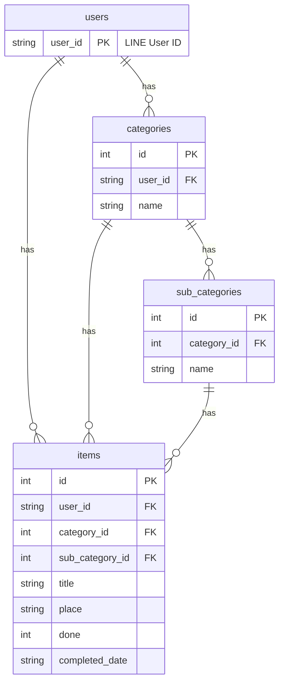

# 資料庫結構：LINE To-Do Bot

本文件詳細說明了 LINE To-Do Bot 使用的 SQLite 資料庫 (`todo.db`) 的結構、資料表及其關聯。

## 總覽

資料庫設計以使用者為中心，所有核心資料都透過 `user_id` 進行區分。整個結構圍繞著三個核心概念：**主分類 (Categories)**、**子分類 (Sub-categories)** 和 **待辦事項 (Items)**。

- 一個使用者可以有**多個**主分類。
- 一個主分類可以有**多個**子分類。
- 一個待辦事項**屬於**一個使用者、一個主分類和一個子分類。

## 資料表詳解

### 1. `categories`

此資料表儲存使用者定義的主分類。

| 欄位名稱 | 資料類型 | 描述 |
| :--- | :--- | :--- |
| `id` | INTEGER | 主鍵，自動遞增。 |
| `user_id`| TEXT | LINE 使用者的唯一 ID。 |
| `name` | TEXT | 分類名稱。 |

**關聯:**
- `categories.id` 是 `sub_categories.category_id` 和 `items.category_id` 的外鍵。

### 2. `sub_categories`

此資料表儲存子分類，並將其關聯到一個主分類。

| 欄位名稱 | 資料類型 | 描述 |
| :--- | :--- | :--- |
| `id` | INTEGER | 主鍵，自動遞增。 |
| `category_id` | INTEGER | 外鍵，關聯到 `categories` 表的 `id`。 |
| `name` | TEXT | 子分類名稱。 |

**關聯:**
- `sub_categories.category_id` -> `categories.id`
- `sub_categories.id` 是 `items.sub_category_id` 的外鍵。

### 3. `items`

此資料表儲存待辦事項的詳細資訊。

| 欄位名稱 | 資料類型 | 描述 |
| :--- | :--- | :--- |
| `id` | INTEGER | 主鍵，自動遞增。 |
| `user_id` | TEXT | LINE 使用者的唯一 ID。 |
| `category_id` | INTEGER | 外鍵，關聯到 `categories` 表的 `id`。 |
| `sub_category_id` | INTEGER | 外鍵，關聯到 `sub_categories` 表的 `id`。 |
| `title` | TEXT | 待辦事項的標題。 |
| `desc` | TEXT | 待辦事項的詳細描述（目前版本未使用）。 |
| `place` | TEXT | 待辦事項發生的地點。 |
| `done` | INTEGER | 完成狀態。`0` 代表未完成，`1` 代表已完成。 |
| `completed_date` | TEXT | 完成日期，格式為 ISO 格式的字串。 |

**關聯:**
- `items.user_id` -> 用於直接查詢特定使用者的所有項目。
- `items.category_id` -> `categories.id`
- `items.sub_category_id` -> `sub_categories.id`

## 實體關聯圖 (ERD)

*註：`users` 表在目前的 schema 中並不存在，此處僅為概念表示，`user_id` 直接儲存在 `categories` 和 `items` 表中。*
