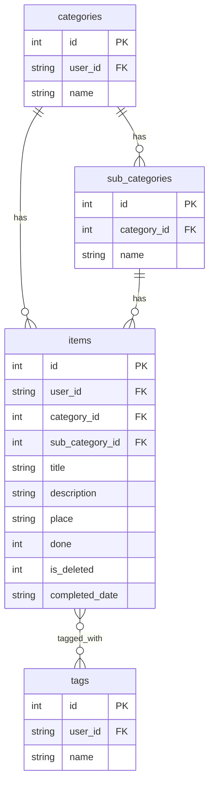

# 資料庫結構：LINE To-Do Bot

本文件詳細說明了 LINE To-Do Bot 使用的資料庫結構。本專案使用 SQLAlchemy ORM 並搭配 **Alembic** 進行資料庫遷移管理，確保 SQLite (本地開發) 與 PostgreSQL (生產環境) 結構一致。

## 總覽

資料庫設計以使用者為中心，所有核心資料都透過 `user_id` 進行區分。整個結構圍繞著三個核心概念：**主分類 (Categories)**、**子分類 (Sub-categories)** 和 **待辦事項 (Items)**。

- 一個使用者可以有**多個**主分類。
- 一個主分類可以有**多個**子分類。
- 一個待辦事項**屬於**一個使用者、一個主分類，並可選擇性屬於一個子分類。
- 事項與子分類、標籤之間亦保留多對多關係的設計彈性。

## 資料表詳解

### 1. `categories`

此資料表儲存使用者定義的主分類。

| 欄位名稱 | 資料類型 | 描述 |
| :--- | :--- | :--- |
| `id` | INTEGER | 主鍵，自動遞增。 |
| `user_id`| TEXT | LINE 使用者的唯一 ID。 |
| `name` | TEXT | 分類名稱。 |

**關聯:**
- `categories.id` 是 `sub_categories.category_id` 和 `items.category_id` 的外鍵。

### 2. `sub_categories`

此資料表儲存子分類，並將其關聯到一個主分類。

| 欄位名稱 | 資料類型 | 描述 |
| :--- | :--- | :--- |
| `id` | INTEGER | 主鍵，自動遞增。 |
| `category_id` | INTEGER | 外鍵，關聯到 `categories` 表的 `id`。 |
| `name` | TEXT | 子分類名稱。 |

**關聯:**
- `sub_categories.category_id` -> `categories.id`
- `sub_categories.id` 是 `items.sub_category_id` 的外鍵。

### 3. `items`

此資料表儲存待辦事項的詳細資訊。

| 欄位名稱 | 資料類型 | 描述 |
| :--- | :--- | :--- |
| `id` | INTEGER | 主鍵，自動遞增。 |
| `user_id` | TEXT | LINE 使用者的唯一 ID。 |
| `category_id` | INTEGER | 外鍵，關聯到 `categories` 表的 `id`。 |
| `sub_category_id` | INTEGER | 外鍵，關聯到 `sub_categories` 表的 `id` (可為 Null)。 |
| `title` | TEXT | 待辦事項的標題。 |
| `description` | TEXT | 待辦事項的詳細描述。 |
| `place` | TEXT | 待辦事項發生的地點。 |
| `done` | INTEGER | 完成狀態。`0` 代表未完成，`1` 代表已完成。 |
| `is_deleted` | INTEGER | 刪除狀態 (Soft Delete)。`0` 代表正常，`1` 代表已刪除。 |
| `completed_date` | TEXT | 完成日期，格式為 ISO 格式的字串。 |

**關聯:**
- `items.user_id` -> 用於直接查詢特定使用者的所有項目。
- `items.category_id` -> `categories.id`
- `items.sub_category_id` -> `sub_categories.id`

### 4. `tags`

儲存標籤資訊。

| 欄位名稱 | 資料類型 | 描述 |
| :--- | :--- | :--- |
| `id` | INTEGER | 主鍵。 |
| `user_id` | TEXT | LINE User ID。 |
| `name` | TEXT | 標籤名稱。 |

### 5. `item_sub_categories` (多對多關聯表)

雖有 `sub_category_id` 欄位，但保留此表以支援單一事項屬於多個子分類的擴充性。

| 欄位名稱 | 資料類型 | 描述 |
| :--- | :--- | :--- |
| `item_id` | INTEGER | 外鍵 (items.id)。 |
| `sub_category_id` | INTEGER | 外鍵 (sub_categories.id)。 |

### 6. `item_tags` (多對多關聯表)

| 欄位名稱 | 資料類型 | 描述 |
| :--- | :--- | :--- |
| `item_id` | INTEGER | 外鍵 (items.id)。 |
| `tag_id` | INTEGER | 外鍵 (tags.id)。 |

## 資料庫遷移 (Migrations)

本專案使用 **Alembic** 管理資料庫版本。

- **初始化/更新**：系統啟動時會自動執行 `alembic upgrade head`，將資料庫更新至最新版本。
- **產生變更腳本**：
  若修改了 `database.py` 中的模型，請執行：
  ```bash
  alembic revision --autogenerate -m "描述變更"
  ```

## 實體關聯圖 (ERD)


```mermaid
erDiagram
    categories {
        int id PK
        string user_id FK
        string name
    }

    sub_categories {
        int id PK
        int category_id FK
        string name
    }

    items {
        int id PK
        string user_id FK
        int category_id FK
        int sub_category_id FK
        string title
        string description
        string place
        int done
        int is_deleted
        string completed_date
    }

    tags {
        int id PK
        string user_id FK
        string name
    }

    categories ||--o{ sub_categories : "has"
    categories ||--o{ items : "has"
    sub_categories ||--o{ items : "has"
    items }o--o{ tags : "tagged_with"

```
