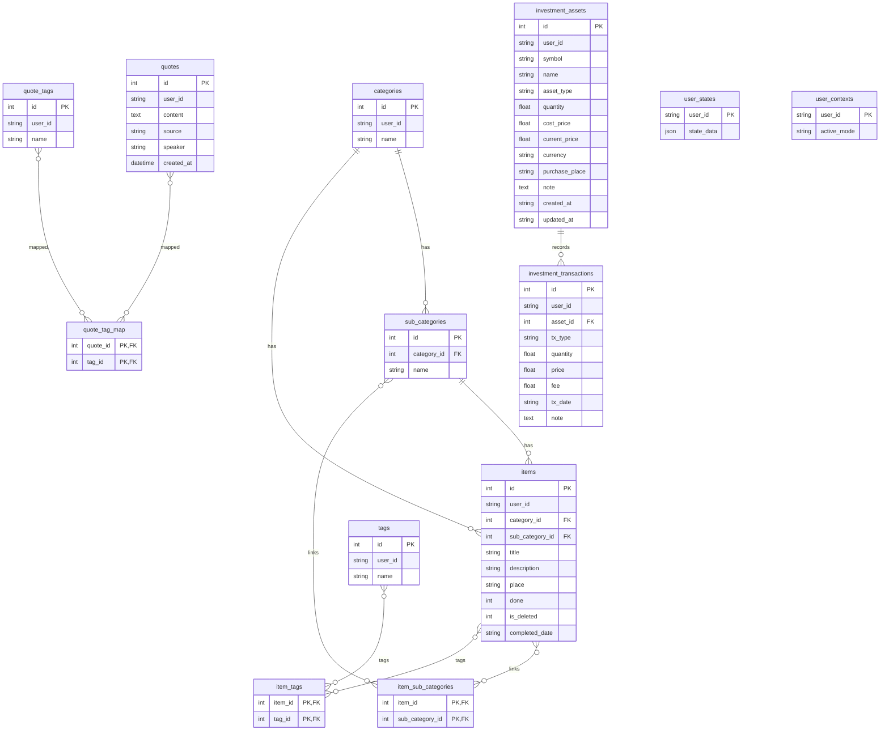

# 資料庫結構：LINE To-Do Bot

本文件說明本專案實際使用的資料庫結構。專案採用 SQLAlchemy ORM，並搭配 Alembic 管理版本遷移，確保本地開發環境的 SQLite 與生產環境的 PostgreSQL 在模型上保持一致。

## 總覽

目前專案可分為四個資料域：

- 待辦事項模組：`categories`、`sub_categories`、`items`、`tags`
- 引用/語錄模組：`quotes`、`quote_tags`、`quote_tag_map`
- 投資追蹤模組：`investment_assets`、`investment_transactions`
- 系統狀態模組：`user_states`、`user_contexts`

所有核心資料都以 `user_id` 作為資料分界，並以 SQLAlchemy `Base.metadata` 集中管理模型。

## 1. 待辦事項資料表

### 1.1 `categories`

儲存使用者自訂的主分類。

| 欄位名稱 | 資料類型 | 描述 |
| :--- | :--- | :--- |
| `id` | INTEGER | 主鍵，自動遞增。 |
| `user_id` | TEXT | LINE 使用者唯一 ID。 |
| `name` | TEXT | 分類名稱。 |

關聯：
- `categories.id` 為 `sub_categories.category_id` 與 `items.category_id` 的外鍵來源。

### 1.2 `sub_categories`

儲存子分類，並隸屬於某個主分類。

| 欄位名稱 | 資料類型 | 描述 |
| :--- | :--- | :--- |
| `id` | INTEGER | 主鍵，自動遞增。 |
| `category_id` | INTEGER | 外鍵，指向 `categories.id`。 |
| `name` | TEXT | 子分類名稱。 |

關聯：
- `sub_categories.category_id` -> `categories.id`
- `sub_categories.id` 可作為 `items.sub_category_id` 的單一預設關聯。

### 1.3 `tags`

儲存使用者建立的標籤。

| 欄位名稱 | 資料類型 | 描述 |
| :--- | :--- | :--- |
| `id` | INTEGER | 主鍵，自動遞增。 |
| `user_id` | TEXT | LINE 使用者唯一 ID。 |
| `name` | TEXT | 標籤名稱。 |

### 1.4 `items`

儲存待辦事項細節。

| 欄位名稱 | 資料類型 | 描述 |
| :--- | :--- | :--- |
| `id` | INTEGER | 主鍵，自動遞增。 |
| `user_id` | TEXT | LINE 使用者唯一 ID。 |
| `category_id` | INTEGER | 外鍵，指向 `categories.id`。 |
| `sub_category_id` | INTEGER | 外鍵，指向 `sub_categories.id`，可為 `NULL`。 |
| `title` | TEXT | 待辦事項標題。 |
| `description` | TEXT | 詳細描述。 |
| `place` | TEXT | 地點。 |
| `done` | INTEGER | 完成狀態，`0` = 未完成，`1` = 已完成。 |
| `is_deleted` | INTEGER | 軟刪除狀態，`0` = 正常，`1` = 已刪除。 |
| `completed_date` | TEXT | 完成日期，為 ISO 時間字串。 |

關聯：
- `items.category_id` -> `categories.id`
- `items.sub_category_id` -> `sub_categories.id`
- `items.user_id` 用於查詢單一使用者的待辦清單。

### 1.5 `item_sub_categories`（多對多關聯表）

雖然 `items` 本身保留 `sub_category_id` 單一欄位，但此關聯表提供同一個待辦可歸屬多個子分類的擴充能力。

| 欄位名稱 | 資料類型 | 描述 |
| :--- | :--- | :--- |
| `item_id` | INTEGER | 外鍵，指向 `items.id`。 |
| `sub_category_id` | INTEGER | 外鍵，指向 `sub_categories.id`。 |

### 1.6 `item_tags`（多對多關聯表）

將待辦事項與標籤建立多對多關聯。

| 欄位名稱 | 資料類型 | 描述 |
| :--- | :--- | :--- |
| `item_id` | INTEGER | 外鍵，指向 `items.id`。 |
| `tag_id` | INTEGER | 外鍵，指向 `tags.id`。 |

## 2. Quote / 語錄資料表

### 2.1 `quotes`

儲存使用者新增的語錄內容。

| 欄位名稱 | 資料類型 | 描述 |
| :--- | :--- | :--- |
| `id` | INTEGER | 主鍵，自動遞增。 |
| `user_id` | TEXT | LINE 使用者唯一 ID。 |
| `content` | TEXT | 語錄內容。 |
| `source` | TEXT | 引用來源，預設 `未填`。 |
| `speaker` | TEXT | 說話者，預設 `未填`。 |
| `created_at` | DATETIME | 建立時間。 |

### 2.2 `quote_tags`

儲存語錄標籤。

| 欄位名稱 | 資料類型 | 描述 |
| :--- | :--- | :--- |
| `id` | INTEGER | 主鍵，自動遞增。 |
| `user_id` | TEXT | LINE 使用者唯一 ID。 |
| `name` | TEXT | 標籤名稱。 |

### 2.3 `quote_tag_map`（多對多關聯表）

將 `quotes` 與 `quote_tags` 建立多對多關聯。

| 欄位名稱 | 資料類型 | 描述 |
| :--- | :--- | :--- |
| `quote_id` | INTEGER | 外鍵，指向 `quotes.id`。 |
| `tag_id` | INTEGER | 外鍵，指向 `quote_tags.id`。 |

## 3. 投資追蹤資料表

### 3.1 `investment_assets`

儲存投資標的資訊。

| 欄位名稱 | 資料類型 | 描述 |
| :--- | :--- | :--- |
| `id` | INTEGER | 主鍵，自動遞增。 |
| `user_id` | TEXT | LINE 使用者唯一 ID。 |
| `symbol` | TEXT | 標的代碼，例如 `2330`、`AAPL`、`BTC`。 |
| `name` | TEXT | 標的名稱。 |
| `asset_type` | TEXT | 資產類別，例如 `台股`、`美股`、`加密貨幣`。 |
| `quantity` | FLOAT | 持有數量。 |
| `cost_price` | FLOAT | 平均成本。 |
| `current_price` | FLOAT | 目前價格。 |
| `currency` | TEXT | 幣別，預設 `TWD`。 |
| `purchase_place` | TEXT | 購買地點。 |
| `note` | TEXT | 備註。 |
| `created_at` | TEXT | 建立時間（ISO 字串）。 |
| `updated_at` | TEXT | 更新時間（ISO 字串）。 |

### 3.2 `investment_transactions`

儲存每次投資操作紀錄。

| 欄位名稱 | 資料類型 | 描述 |
| :--- | :--- | :--- |
| `id` | INTEGER | 主鍵，自動遞增。 |
| `user_id` | TEXT | LINE 使用者唯一 ID。 |
| `asset_id` | INTEGER | 外鍵，指向 `investment_assets.id`。 |
| `tx_type` | TEXT | 交易類型，例如 `BUY`、`SELL`、`DIVIDEND`。 |
| `quantity` | FLOAT | 交易數量。 |
| `price` | FLOAT | 交易價格。 |
| `fee` | FLOAT | 手續費。 |
| `tx_date` | TEXT | 交易日期。 |
| `note` | TEXT | 備註。 |

## 4. 系統狀態資料表

### 4.1 `user_states`

儲存 LINE 使用者的對話狀態快取。

| 欄位名稱 | 資料類型 | 描述 |
| :--- | :--- | :--- |
| `user_id` | TEXT | 主鍵，LINE 使用者唯一 ID。 |
| `state_data` | JSON | 使用者當前狀態資料。 |

### 4.2 `user_contexts`

儲存使用者目前的子助理模式（active mode）。

| 欄位名稱 | 資料類型 | 描述 |
| :--- | :--- | :--- |
| `user_id` | TEXT | 主鍵，LINE 使用者唯一 ID。 |
| `active_mode` | TEXT | 當前模組模式，例如 `todo`、`quote`、`investment`。 |

## 5. 系統管理表

### `alembic_version`

此資料表由 Alembic 自動管理，僅用於追蹤資料庫目前遷移版本，不是業務資料表。

## 6. 資料匯出 / 匯入備份說明

目前專案支援以 SQL 備份檔方式進行資料匯出與還原，這種方式最適合對應既有的 SQLAlchemy 模型結構，並能直接重放到資料庫中。

### 6.1 匯出模式

匯出主要是將資料以 `INSERT INTO ... VALUES ...` 的 SQL 語句組成，方便直接還原到同一個資料庫結構。

#### 全部資料匯出

- `GET /api/export`
- 回傳內容：純文字 SQL，檔名為 `all_backup.sql`
- 內容格式：
  - `-- TODO MODULE`
  - `-- INVESTMENT MODULE`
  - `-- QUOTE MODULE`
  - 之後各自附帶該模組的 `INSERT` 語句

#### 模組單獨匯出

- `GET /api/todo/export`
- `GET /api/investment/export`
- `GET /api/quote/export`

上述 API 均會回傳該模組對應資料表的 SQL 備份內容，適合針對單一功能模組做備份。

### 6.2 匯入模式

匯入流程會讀取用戶上傳的 SQL 備份內容，逐筆解析 `INSERT` 語句後重新執行到資料庫中。這種方式保持了與匯出時一致的資料重建邏輯。

#### 全部資料匯入

- `POST /api/import`
- 請求格式：原始文字內容，內容應為 `GET /api/export` 產生的 SQL 備份內容
- 回應：`{"status": "success"}`

#### 模組單獨匯入

- `POST /api/todo/import`
- `POST /api/investment/import`
- `POST /api/quote/import`

這些 API 用於將某一個模組的 SQL 備份重新載入到資料庫，讓備份/還原流程可以拆分為模組級別操作。

### 6.3 匯出內容範圍

目前匯出內容覆蓋以下主表與關聯表：

- 待辦模組：`categories`、`sub_categories`、`tags`、`items`、`item_sub_categories`、`item_tags`
- 語錄模組：`quote_tags`、`quotes`、`quote_tag_map`
- 投資模組：`investment_assets`、`investment_transactions`

### 6.4 使用建議

- 若要做整體資料備份，建議使用 `GET /api/export`。
- 若只想備份某一個模組，例如待辦資料，則使用 `GET /api/todo/export`。
- 匯入時必須使用與匯出對應的 SQL 結構，避免在不同版本的資料庫欄位格式之間直接重放。

## 7. 實體關聯圖（ERD）

```mermaid
erDiagram
    categories {
        int id PK
        string user_id
        string name
    }

    sub_categories {
        int id PK
        int category_id FK
        string name
    }

    items {
        int id PK
        string user_id
        int category_id FK
        int sub_category_id FK
        string title
        string description
        string place
        int done
        int is_deleted
        string completed_date
    }

    tags {
        int id PK
        string user_id
        string name
    }

    item_sub_categories {
        int item_id PK, FK
        int sub_category_id PK, FK
    }

    item_tags {
        int item_id PK, FK
        int tag_id PK, FK
    }

    quotes {
        int id PK
        string user_id
        text content
        string source
        string speaker
        datetime created_at
    }

    quote_tags {
        int id PK
        string user_id
        string name
    }

    quote_tag_map {
        int quote_id PK, FK
        int tag_id PK, FK
    }

    investment_assets {
        int id PK
        string user_id
        string symbol
        string name
        string asset_type
        float quantity
        float cost_price
        float current_price
        string currency
        string purchase_place
        text note
        string created_at
        string updated_at
    }

    investment_transactions {
        int id PK
        string user_id
        int asset_id FK
        string tx_type
        float quantity
        float price
        float fee
        string tx_date
        text note
    }

    user_states {
        string user_id PK
        json state_data
    }

    user_contexts {
        string user_id PK
        string active_mode
    }

    categories ||--o{ sub_categories : "has"
    categories ||--o{ items : "has"
    sub_categories ||--o{ items : "has"
    items }o--o{ item_sub_categories : "links"
    sub_categories }o--o{ item_sub_categories : "links"
    items }o--o{ item_tags : "tags"
    tags }o--o{ item_tags : "tags"
    quotes }o--o{ quote_tag_map : "mapped"
    quote_tags }o--o{ quote_tag_map : "mapped"
    investment_assets ||--o{ investment_transactions : "records"
```
